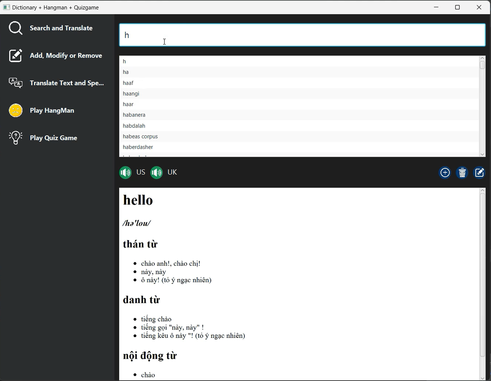
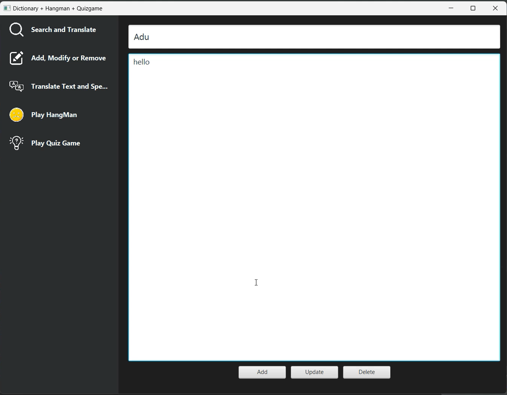
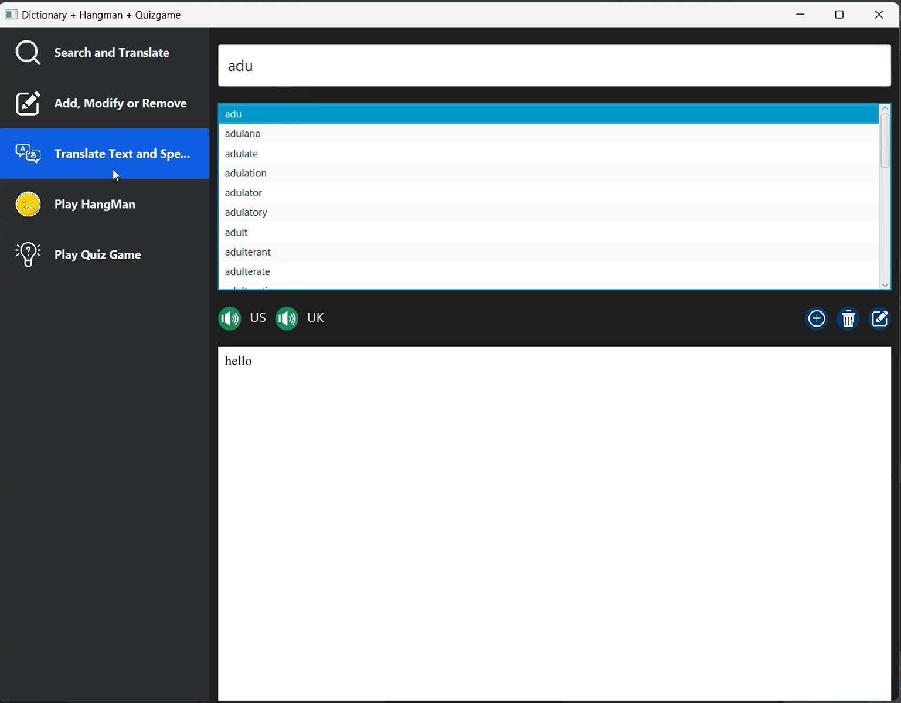
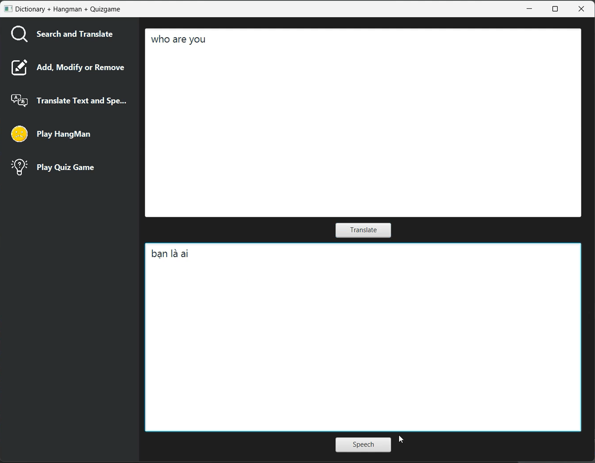
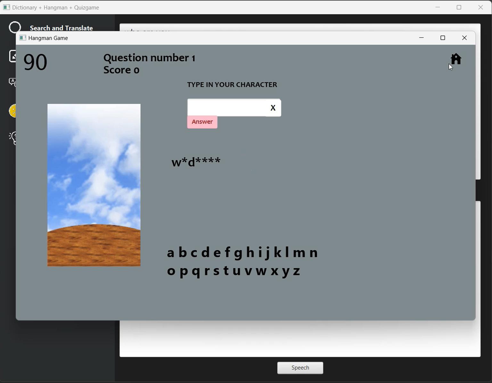
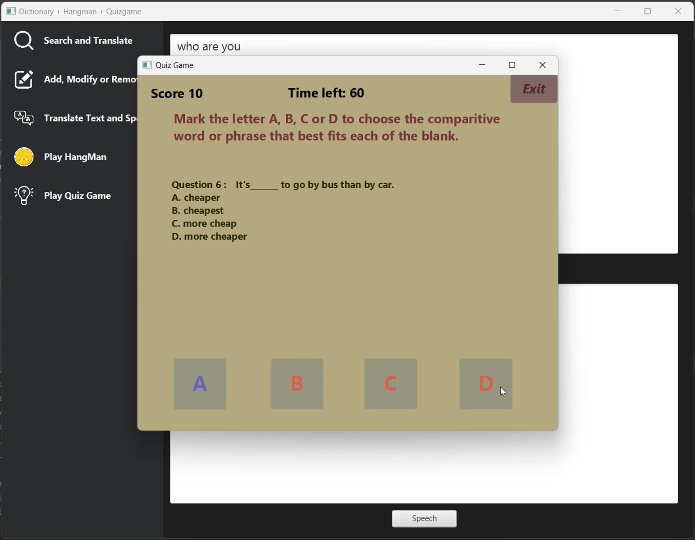

# Application to support learning English using Java

## Author

Group Loli

1. Pham Nhat Quang - 23020413
2. Bui Minh Quan - 23020415
3. Phan Quang Truong - 23020443
4. Phi Tran Toan - 19021373

## Description

The application is designed to support learning English. The application is written in Java using the JavaFX library and CSS helping improve the application's user interface. The application is based on the MVC model. The application use SQLite3 for storing data with enormous types of languages, also Voice RSS - Text-to-speech API for turning user's voices into text and Google Translate API helping translate to your languages as well.

1. The application is designed to support learning English.
2. The application is written in Java and uses the JavaFX library.
3. The application is based on the MVC model.
4. The application is also written in CSS for building application's user interface.
5. The application use Voice RSS, a TTS API, for turning speech to text.
6. The application is equipped with a Google Translate API to translate word.
7. The application has SQLite3 for data storing.

## UML diagram

## Installation

1. Clone the project from the repository.
2. Open the project in the IDE.
3. Run the project in Main.java.

## Usage

 <!-- Bo sung Add/Remove/Modify co dau ... -->
_**1**_. Select mode: _**Search and Translate**_ or _**Add, Modify or Remove**_, _**Translate Text and Speech**_ and **_Play HangMan_** and _**Play Quiz Game**_ .

_**2**_.In Search and Translate, there are 4 parts: _Search Bar_, _Words List_, _US/UK Pronounce_, _Add/Remove/Modify Button_ and _Result Table_.
   
Button Titles or Positions:
   - _**Search Bar**_ : "Search a word...".
   - _**Words List**_ : under Search Bar.
   - _**US/UK Pronounce**_ : Speaker items.
   - _**Add/Remove/Modify Button**_ : ....
   - _**Result Table**_ : under Words List.
   
Using Guide:
   - To search word, click your mouse to the search bar then type your word that you want to translate into other 
   languages then take a look at Words List. If that word doesn't exist, Words List won't show anything.
   - To translate word, first search the word, then take a look at the Result Table. If that word doesn't exist, 
   Result Table won't show anything.
   - To speech a word, first search word then click on the US/UK Pronounce Button. If that word doesn't exist,
   US/UK Pronounce Button is not useful.
   - To Add/Remove/Modify, ....

_**3**_. In Add, Modify or Remove, there are 5 parts: _Word Bar1_, _Word Bar2_, _Add Button_, _Modify Button_, _Remove Button_.
   
Button Titles or Positions:
   - _**Word Bar1**_ : "Enter word you want to add or modify"
   - _**Word Bar2**_ : "Type the meaning of above word..."
   - _**Add Button**_ : "Add"
   - _**Modify Button**_ : "Update"
   - _**Remove Button**_ : "Delete"
   
Using Guide:
   - To add word, type the word in the Word Bar1 and its meaning in the Word Bar2, then click on the Add Button, then 
   search word to check the result.
   - To modify word, type the word in the Word Bar1 and its meaning in the Word Bar2, then click on the Modify Button, 
   then search word to check the result. If that word doesn't exist, it will be add in the dictionary.
   - To remove word, type the word in the Word Bar1, then click on the Remove Button, then search word to check the 
   result. If that word doesn't exist, it seems meaningless to do that with our dictionary :).

_**4**_. In Translate Text and Speech, there are 4 parts: _Text Box_, _Translate Button_, _Speech Button_, _Translated Text Box_.

Button Titles or Positions:
   - _**Text Box**_: "Nhập văn bản tiếng Anh..."
   - _**Translate Button**_: "Translate"
   - _**Speech Button**_: "Speech"
   - _**Translated Text Box**_ : "Translated text..."

Using Guide:
   - To translate text, type your text or copy/paste into the Text Box then click on Speech Button and take a look at Translated Text Box.
   If any word in the text is meaningless, translator will return that word.
   - To turn text into sound, first type the text and translate, then click on the Speech Button under the Translated Text Box.

_**5**_. In HangMan Game:
   - To start the game, click the "Start" button.
   - You must find the right English word hidden by "*".
   - To answer, type your character in answer box and click answer button.
   - If you type more than 1 character and click answer button, there will be a warning telling you that you can't do that. Click "OK" to continue,
   - To clear the character that you typed by mistake, click "X" button of the right side of answer button.
   - To return game main screen, click "Home" Button, you will see a window asking you want to keep playing or not. Click "yes" to return main menu, else keep playing.
   - When HangMan complete that means you lose and the game over will be printed, if not you will jump to next word until you get game over.
   - To exit to Translator Main Menu, click on the X button on the up-right side of the game window.

_**6**_. In Quiz Game:
   - To start the game, click the "Start Game" button.
   - To answer, choose A,B,C or D. If you get the right answer you will get 10 point else you have nothing.
   - The right answer has a blue color, others has a red one.
   - To return game main menu, click the "Exit" Button. You will see a window asking you want to exit or not. Click "OK" to exit, click "Cancel" to keep playing.
   - You have to answer 50 questions, and at each range of points you will get a kind of compliments.
   - To exit to Translator Main Menu, click on the X button on the up-right side of the game window.
## Demo
   - Search and Translate:
     - 
     
   - Add, Modify or Remove:
     - 
     - Word in:
   
     - Result:
     
   - Translate Text and Speech
        - 
     
   - Hang Man:
        - 
     
   - Quiz Game:
     - 
       

## Future improvements

1. Improve the user interface by using CSS.
2. Add more complex games (Hangman, Quiz).
3. Optimize the word lookup algorithm (Trie).
4. Use a database to store data (SQL).
5. Integrate the application with API of Google Translate to translate paragraphs and whole documents.
6. Integrate the application with API of Voice RSS to Text to convert speech to text.

## Contributing

Pull requests are welcome. For major changes, please open an issue first to discuss what you would like to change.

## Project status

The project is completed.

## Notes

The application is written for educational purposes.
