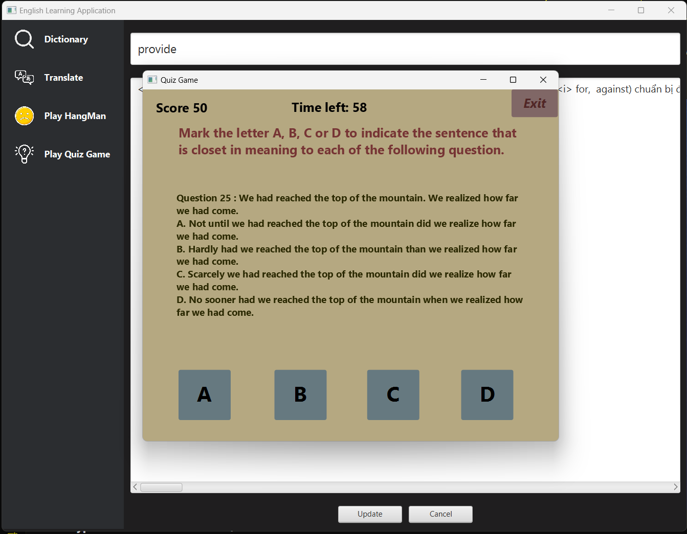

# Application to support learning English using Java

## Author

Group Loli

1. Pham Nhat Quang - 23020413
2. Bui Minh Quan - 23020415
3. Phan Quang Truong - 23020443
4. Phi Tran Toan - 19021373

## Description

1. The application is designed to support learning English.
2. The application is written in Java and uses the JavaFX library.
3. The application is based on the MVC model.
4. The application is also written in CSS for building application's user interface.
5. The application uses SQLite3 databases to store enormous amount of words (110k) to serve as a dictionary.
6. The application uses Voice RSS, API to turn text to speech.
7. The application uses Google Translate API as a translating method.

## Inheritance Tree

## Installation

1. Clone the project from the repository.
2. Open the project in the IDE.
3. Run the project in MainController.java.

## Usage

_**1**_. Select mode: _**Dictionary**_ or _**Translate**_, **_Play HangMan_** and _**Play Quiz Game**_ .

_**2**_. In _**Dictionary**_, there are 4 parts: _Search Bar_, _Words List_, _US/UK Pronounce_, _Add Button_, _Remove Button_, _Modify Button_ and _Result Box_.
   
Button Titles or Positions:
   - _**Search Bar**_ : "Search a word...".
   - _**Words List**_ : under Search Bar.
   - _**US/UK Pronounce**_ : Speaker icon with US or UK title.
   - _**Add Button**_ : A plus with a circle icon.
   - _**Remove Button**_ : A bin icon.
   - _**Modify Button**_ : A pencil with a square icon.
   - _**Result Table**_ : under Words List.
   
Using Guide:
   - To search a word, click your mouse to the search bar then type your word that you want to translate into other languages then take a look at Words List. If that word doesn't exist, Result Box will keep asking you to type in a word.
   - To translate a word, first search the word, then take a look at the Result Table. If that word doesn't exist, Result Table will keep asking you to type in a word.
   - To speech a word, first search word then click on the US/UK Pronounce Button. If that word doesn't exist, US/UK Pronounce Button is not useful.
   - To add a word, click on Add Button then type your word in the first Bar, then type its meaning in the second bar (Optional) then click on the button named "Add". If that word isn't a new word, then this function is the same as Modify.
   - To remove a word, first try to search it, if you found it that means that word haven't been deleted yet. Click on that word in Words List, then click Remove Button.
   - To modify a word, click on Modify Button then type your word in the first bar then type its meaning as you want to update then clcik on the button named "Update". If that word is a new word, then this function is the same as Add.

_**3**_. In Translate there are 4 parts:

_**4**_. In HangMan Game:
  - To start the game, click the "Start" button.
  - You must find the right English word hidden by "*".
  - To answer, type your character in answer box and click answer button.
  - If you type more than 1 character and click answer button, there will be a warning telling you that you can't do that. Click "OK" to continue,
  - To clear the character that you typed by mistake, click "X" button of the right side of answer button.
  - To return game main screen, click "Home" Button, you will see a window asking you want to keep playing or not. Click "yes" to return main menu, else keep playing.
  - When HangMan complete that means you lose and the game over will be printed, and you can try again by click Circle-Arrow to play again, if not click double-arrow button to jump to next word until game over.
  - To exit to Translator Main Menu, click on the X button on the up-right side of the game window.

_**5**_. In Quiz Game:
  - To start the game, click the "Start Game" button.
  - To answer, choose A,B,C or D. If you get the right answer you will get 10 point else you have nothing.
  - To return game main menu, click the "Exit" Button. You will see a window asking you want to exit or not. Click "OK" to exit, click "Cancel" to keep playing.
  - You have to answer 50 questions, and at each range of points you will get a kind of compliments.
  - To exit to Translator Main Menu, click on the X button on the up-right side of the game window.
## Demo
<!-- Nho sua 3.png-->
   - Dictionary:
     - 
     - Search and Speech
     
     - Add Window:
     
     - Modify Window:
     
   - Translate Text and Speech
        - 
     
   - Hang Man:
        - 
     
   - Quiz Game:
     - 
       

## Future improvements

1. Improve the user interface.
2. Add more complex games.

## Contributing

Pull requests are welcome.

## Project status

The project is completed.

## Notes

The application is written for educational purposes.
